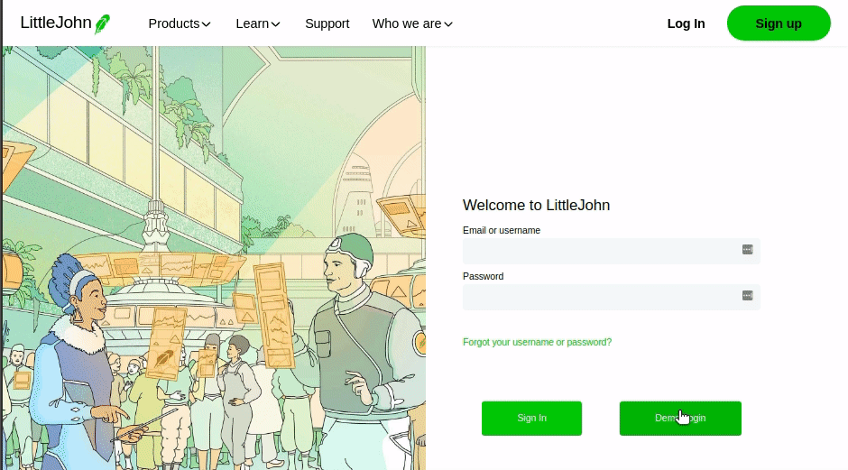
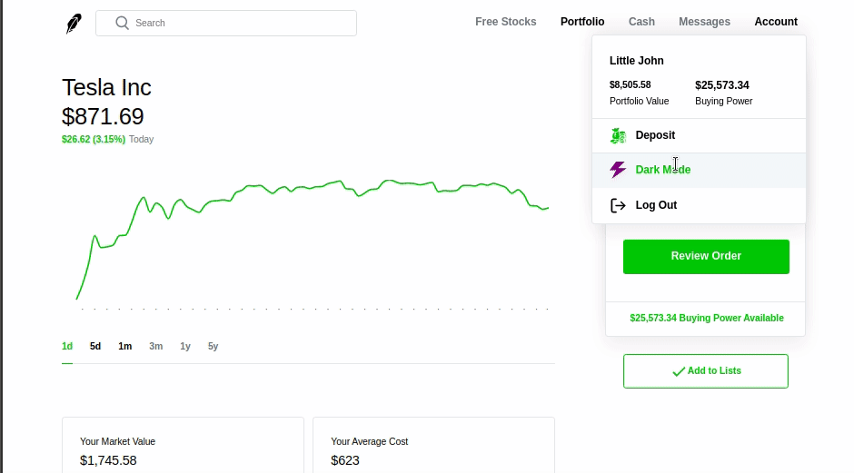
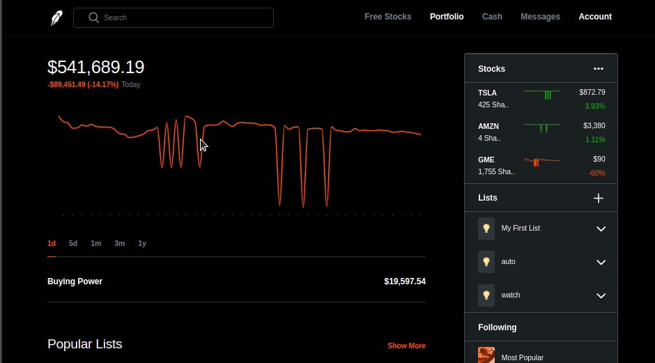
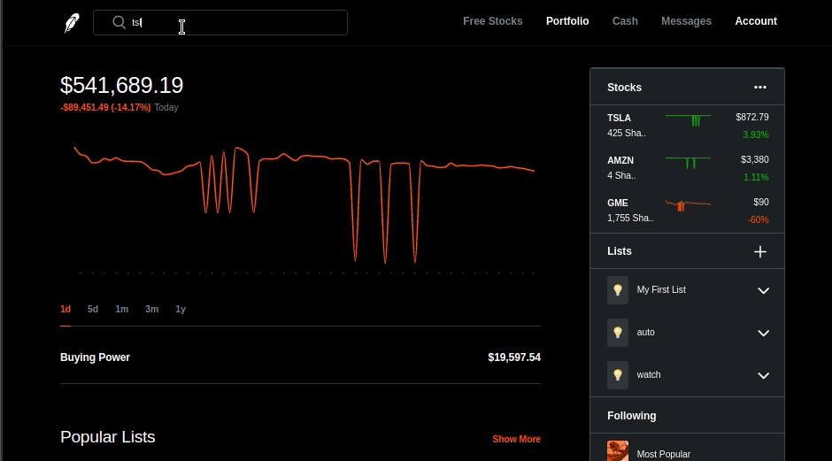
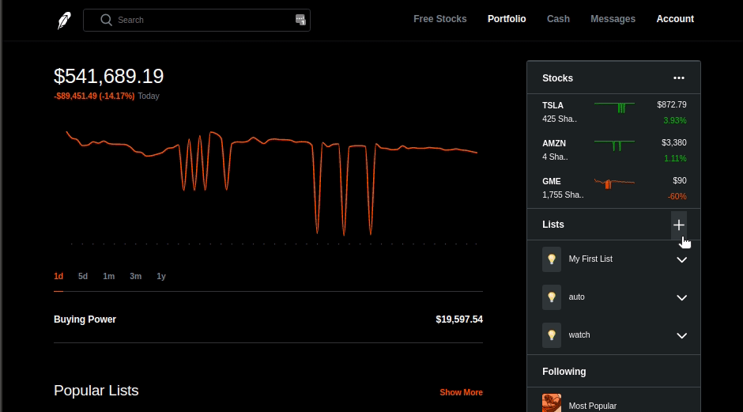
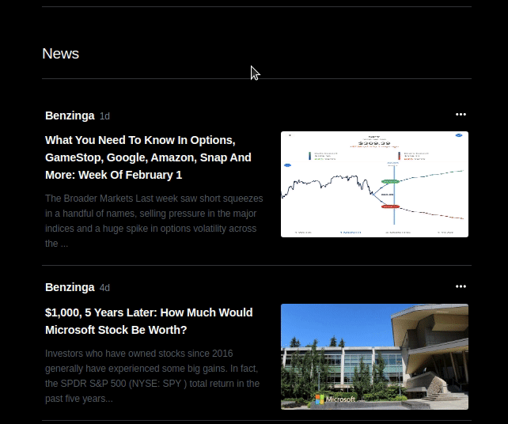
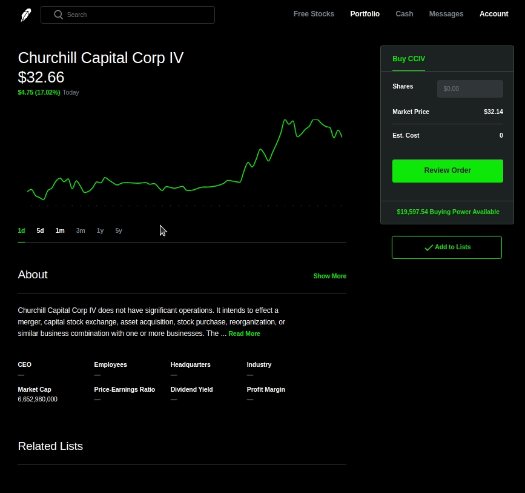
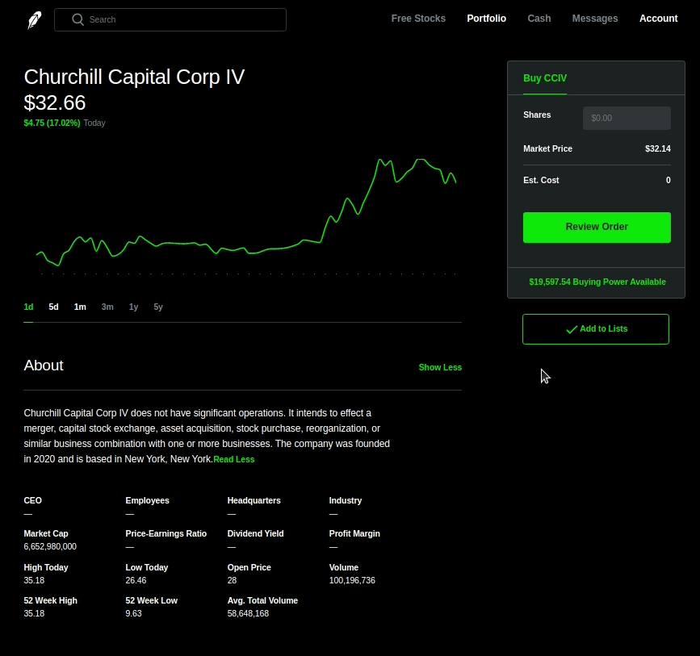

[Live App](https://littlejohnn.herokuapp.com)

LittleJohn is a trading app used to track, discover, and trade stocks, 
aiming to be a pixel-perfect clone of the popular trading app,
[RobinHood](https://robinhood.com/). Stonks only go up!

# Technologies

## Frontend

-   Javascript
-   Scss
-   Bootstrap
-   React + Redux
-   Webpack / npm

## Backend

-   Ruby on Rails
-   Postgresql
-   JBuilder

# Features

## Account

-   Secure login and signup using BCrypt
-   Deposit funds
-   Demo Login

-   Light/Dark modes

## Portfolio

The main portfolio page acts as the management console for owned and watched
stocks, which are accessible through the sidebar.

-   Individual stocks and positions are displayed with sparklines along with their
    latest quotes and holdings.
-   A central interactive graph summarizes overal portfolio performance

## Search

A searchbar is available once logged in to search for assets by ticker or
company name.

Due to rate-limiting of the free tier Alphavantage API used for searching
results, searches will occasionally become unavailable until the limit is no
longer exceeded.

## Watchlists

Watchlists are used to group and track assets of interest, display their
real-time quotes, and providing fast access to their detailed pages.

Lists can be created, edited, and rearranged in the main sidebar.

## News

Receent market news is summarized on the portfolio page from a variety of
sources.

## Stocks

Each stock can be examined in more detail, bought and sold.  Detailed pages
contain:

-   interactive times series for stocks over different intervals
-   details of holdings (if the assets are part a user's portfolio)
-   information about companies
-   daily performance indicators
-   a sidebar to buy/sell shares

Stocks can be added and removed from watchlists from the detail page.

# Future Features

-   News related to individual stocks on their show pages
-   API with better rate-limiting that doesn't crap out after a few searches
-   More time intervals for portfolio graph
-   Toggle between price displays: after-hours, equity, daily return, etc.

